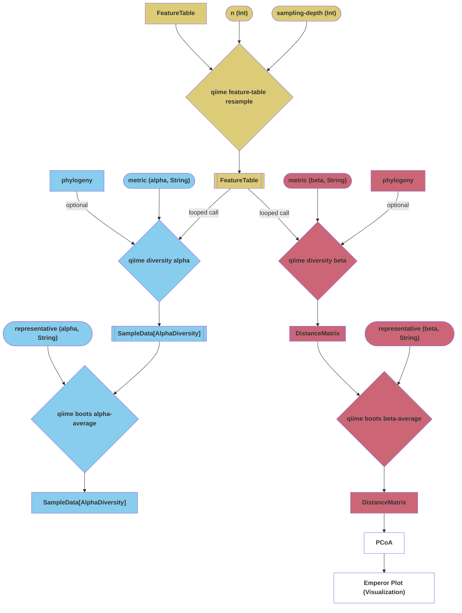

```mermaid
flowchart TD
    
    feature-table["<b>FeatureTable"] --> resample
    n(["<b>n (Int)"]) --> resample
    sampling-depth(["<b>sampling-depth (Int)"]) --> resample
    phylogeny-alpha[<b>phylogeny] -- optional --> div-alpha
    alpha-metric(["<b>metric (alpha, String)"]) --> div-alpha
    resample{<b>qiime feature-table resample} -->
    feature-collection[[<b>FeatureTable]] -- looped call --> div-alpha
    feature-collection -- looped call --> beta-diversity
    div-alpha{<b>qiime diversity alpha} --> sd-collection
    alpha-rep(["<b>representative (alpha, String)"]) --> alpha-avg
    sd-collection[["<b>SampleData[AlphaDiversity]"]] -->
    alpha-avg{<b>qiime boots alpha-average} -->
    sample-data["<b>SampleData[AlphaDiversity]"]

    style feature-table fill:#DDCC77
    style n fill:#DDCC77
    style sampling-depth fill:#DDCC77
    style resample fill:#DDCC77
    style feature-collection fill:#DDCC77

    style phylogeny-alpha fill:#88CCEE
    style alpha-metric fill:#88CCEE
    style div-alpha fill:#88CCEE
    style sd-collection fill:#88CCEE
    style alpha-rep fill:#88CCEE
    style alpha-avg fill:#88CCEE
    style sample-data fill:#88CCEE

    beta-diversity{<b>qiime diversity beta} --> dms
    beta-metric(["<b>metric (beta, String)"]) --> beta-diversity
    phylogeny-beta[<b>phylogeny] -- optional --> beta-diversity

    dms[[<b>DistanceMatrix]] --> beta-average
    beta-rep(["<b>representative (beta, String)"]) -->
    beta-average{<b>qiime boots beta-average} -->
    dm[<b>DistanceMatrix]
  
    style beta-diversity fill:#CC6677
    style beta-metric fill:#CC6677
    style phylogeny-beta fill:#CC6677
    style dms fill:#CC6677
    style beta-rep fill:#CC6677
    style beta-average fill:#CC6677
    style dm fill:#CC6677

    dm --> pcoa[<b>PCoA] --> emperor-plot
    style pcoa fill:white
    style emperor-plot fill:white
    emperor-plot["<b>Emperor Plot (Visualization)"]
    
```
  