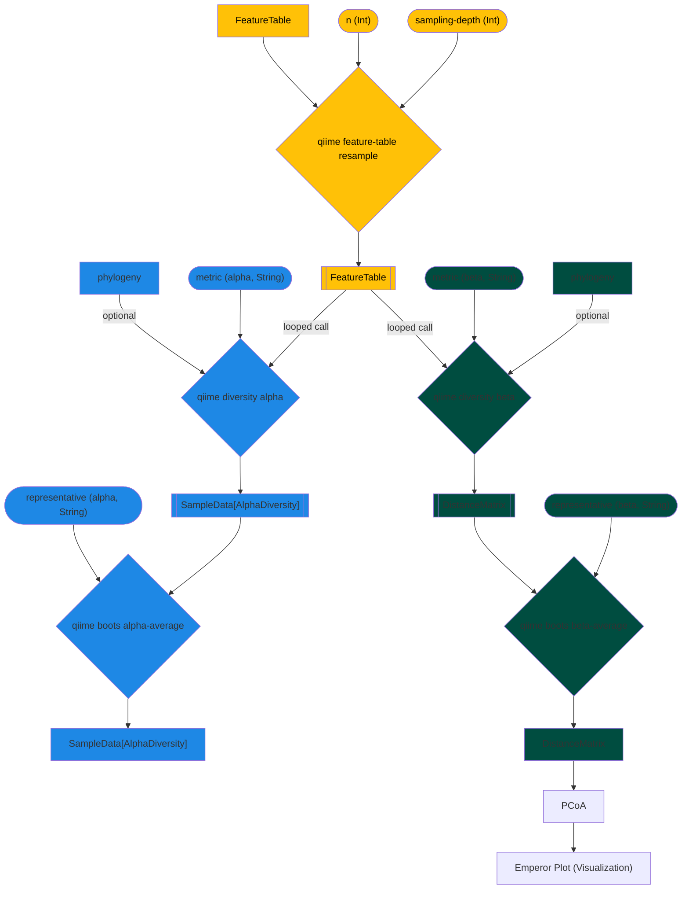

```mermaid
flowchart TD
    
    feature-table[FeatureTable] --> resample
    n(["n (Int)"]) --> resample
    sampling-depth(["sampling-depth (Int)"]) --> resample
    phylogeny-alpha[phylogeny] -- optional --> div-alpha
    alpha-metric(["metric (alpha, String)"]) --> div-alpha
    resample{qiime feature-table resample} -->
    feature-collection[[FeatureTable]] -- looped call --> div-alpha
    feature-collection -- looped call --> beta-diversity
    div-alpha{qiime diversity alpha} --> sd-collection
    alpha-rep(["representative (alpha, String)"]) --> alpha-avg
    sd-collection[["SampleData[AlphaDiversity]"]] -->
    alpha-avg{qiime boots alpha-average} -->
    sample-data["SampleData[AlphaDiversity]"]

    style feature-table fill:#FFC107
    style feature-table color:black

    style n fill:#FFC107
    style n color:black

    style sampling-depth fill:#FFC107
    style sampling-depth color:black

    style resample fill:#FFC107
    style resample color:black
    style feature-collection color:black
    style feature-collection fill:#FFC107

    style phylogeny-alpha fill:#1E88E5
    style alpha-metric fill:#1E88E5
    style div-alpha fill:#1E88E5
    style sd-collection fill:#1E88E5
    style alpha-rep fill:#1E88E5
    style alpha-avg fill:#1E88E5

    style sample-data fill:#1E88E5

    beta-diversity{qiime diversity beta} --> dms
    beta-metric(["metric (beta, String)"]) --> beta-diversity
    phylogeny-beta[phylogeny] -- optional --> beta-diversity

    dms[[DistanceMatrix]] --> beta-average
    beta-rep(["representative (beta, String)"]) -->
    beta-average{qiime boots beta-average} -->
    dm[DistanceMatrix]
  
    style beta-diversity fill:#004D40

    style beta-metric fill:#004D40
    style phylogeny-beta fill:#004D40
    style dms fill:#004D40
    style beta-rep fill:#004D40
    style beta-average fill:#004D40
    style dm fill:#004D40

    dm --> pcoa[PCoA] -->
    emperor-plot["Emperor Plot (Visualization)"]
    
```
  