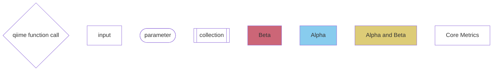

```mermaid
flowchart TD
function-call{qiime function call}
    input
    parameter([parameter])
    collection[[collection]]

    style function-call fill:white
    style input fill:white
    style parameter fill:white
    style collection fill:white

    style Beta fill:#CC6677
    style Alpha fill:#88CCEE
    AB[Alpha and Beta]
    style AB fill:#DDCC77
    core-metrics[Core Metrics]
    style core-metrics fill:white
```
